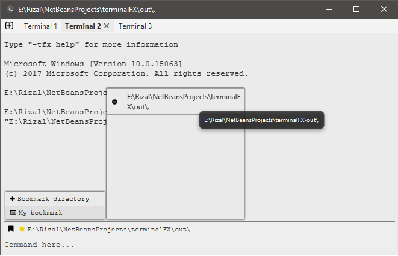
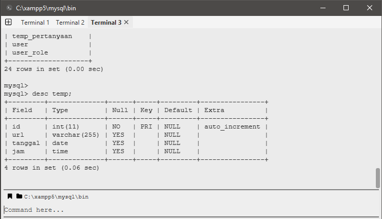

# TerminalFX
**TerminalFX is terminal emulator create using JavaFX**

	

**Feature**
1. Multiple terminal
2. Save commands
3. Save target folder directory
4. monitor your last commands

**Requirements**
- Java Runtime Version 8
- Windows / Linux / MacOS (Only test on Windows)

this library is placed in folder "library". I build using Ant. So you have to add library manually.

I am very welcome for any feedback to make this app better.

*Anyway, dont forget to be happy :D*
